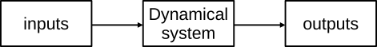
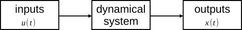
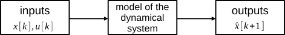

# Interact with data

With AutomationLabs there are two kinds of data:

* raw data: data that users can store on the database and local folder.
* io data: data where data processing has been performed for model identification. The io data are used by AutomationLabs to tune models and they are derived from the raw data.

Furthermore, AutomationLabs depicts data in inputs vs output manner, such as:



We can introduce the state of dynamical system, noted as $$x(t)$$ and the inputs of the dynamical system noted as $$u(t)$$. It is assumed that the state of our dynamic system is the measured output:



AutomationLabs is a computer tool and there is discretized data management, the state and inputs are noted as: $$x[k]$$and $$u[k]$$with $$k \in \mathbb{N}_{\ge 0}$$the sample index, $$x[k]=x(t_k), t_k = k \times T_s$$, with $$T_s$$the sample time.

## Add raw data

You can add raw data on the database on a dedicated project:

```julia
julia> project(:create, name = "project_1")
julia> data(:add; project_name = "project_1", path = "path_to_data", name = "data_inputs_m3h")
```

`path` allows you to specify the folder path where the data are located on the hard drive, and `name` the name of file. Also, please note that the file extension need to be .CSV.

## List raw data

You can list the raw data on the database:

```julia
julia> data(:lsraw, project_name = "project_1")
```

## io data

The raw data are not directly used to identify a dynamical system and to get a model from data. It is necessary to process the data. The purpose of a model is to predict the state at the next sample index $$\hat{x}[k+1]$$with the state and the input at the current sample index.



The mathematical formulation of the model with the state and input is:

```math
\hat{x}[k+1] = f(x[k], u[k])
```

where $$\hat{x}[k+1]$$ is the predicted states of the dynamical system, $$x[k]$$is the state of the dynamical system at current time, $$u[k]$$ is the dynamical system inputs at current time, and $$f$$is the unknown mathematical formulation of the dynamical system model.

The io data command can manage the raw data to get the predicted state as the outputs of the model and the current state and the input as the inputs of the model:

```julia
julia> data(:io;
        inputs_data_name =  "input_raw_data",
        outputs_data_name = "outputs_raw_data",
        project_name = "project_1", 
        data_name = "io_name"
    )
```

It is possible to add extra parameters to process the raw data when creating io data. For instance, deep time delay with `n_delay`, data normalization with `normalization`,  data limit with lower or upper bound, `data_lower_input`, `data_upper_input`, `data_lower_output`, `data_upper_output`_,_ `data_type.`

## List io data

You can list the io data located on the database:

```julia
julia> data(:lsio, project_name = "project_1")
```

You can also list the raw and io data at the same time:

```julia
julia> data(:ls, project_name = "project_1")
```

## Remove data

You can remove raw or io data from the database:

```julia
julia> data(:rmraw, project_name = "project_1", data_name = "input_raw_data")
julia> data(:rmio, project_name = "project_1", data_name = "io_name")
```
