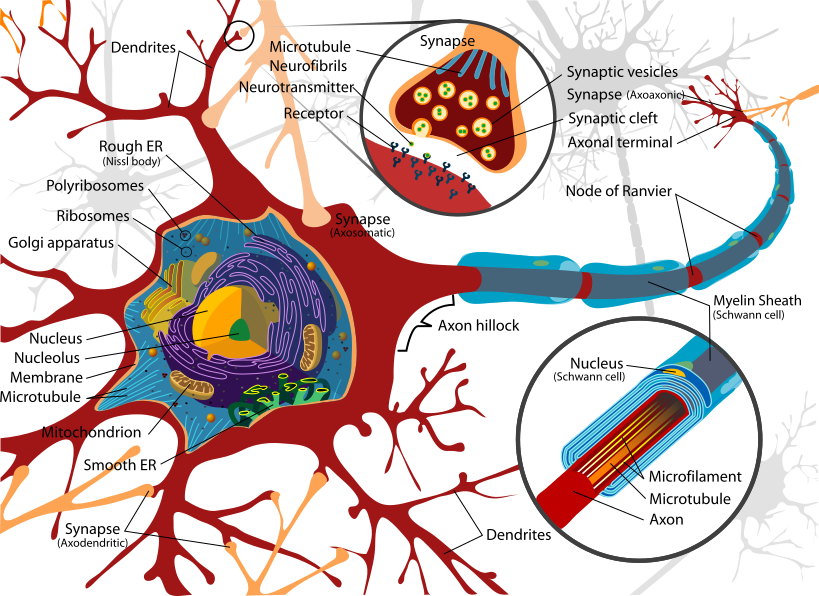
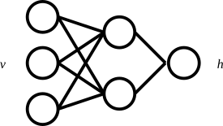
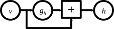
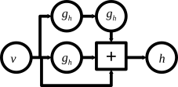
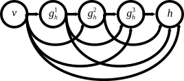
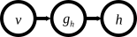

# Blackbox models description

## Parametric

### Linear model

The linear model is the simplest model with only a wieights matric, it is defined as:

```math
h = W(v)
```

where, $$h$$ is the output, $$W$$ is a weighting matrix and $$v$$ is the input. In the case of the dynamical system identification with $$h$$ the predicted state ($$\hat{x}_{k+1}$$) and $$v$$ the state and input at current time ($$x[k], u[k]$$) , the linear model can be redesign as classical linear state space model:

```math
\hat{x}[k+1] = A x[k] + Bu[k]
```

where, $$A$$ is the state matrix and $$B$$ the input matrix from $$W$$. The Linear model can be selected with `model_architecture`:

```julia
julia> model(:tune; 
        project_name = "name",
        model_name = "model",
        io = "io_name",
        computation_solver = "lls",
        model_architecture = "linear", 
    )
```

where `project_name` the name of the related project, `model_name` the name of the model when saving on the database, `io` the name of input-output data, `computation_solver` the solver selected, and `model_architecture` the mathematical model selected.

## Neural networks

The artificial neuron is derived from the biological neuron. Modelling a biological neuron is complex and, its mathematical modelling is carried out with several simplifying assumptions, retaining only the basic principle of its ability to communicate through electrical signals. A illustration of a biological description is:



Diagram of the simplification of the biological neuron, from By LadyofHats - Own work. Image renamed from Image:Complete neuron cell diagram.svg, Public Domain, https://commons.wikimedia.org/w/index.php?curid=3970826.

The first mathematical model of a neuron was proposed by W. McCulloch and W. Pitts after observation of frog neurons \[1]. The model has a activation with output equal to 1 or 0. If the inputs connected to the neuron are activated above a certain threshold, then the output of the neuron becomes equal to 1 \[2]. The artificial neurons commonly used for machine learning are different from the McCulloch and Pitts model. The artificial neuron has an activation function, weights and bias \[3], and the mathematical formulation is equal to:

```math
h=\sigma(Wv+b)
```

where, $$h$$ is the output, $$\sigma$$ is the activation function, $$W$$ is the weighting matrix, $$v$$ is the input vetor, and $$b$$ the the bias vector.

### Feedforward neural network (Fnn)

The artificial neurons are stacked in deep manner to form the feedforward neural network. A representation of the network with one hidden layer is:



In the special case where the network has one hidden layer, a finite number of neurons and the sigmoid activation function, then the network can approximate any continuous continuous function \[4] and it proves to be a universal approximator \[5]. The generic mathematical formulation is \[6]:

```math
h=\mathcal{G}(v) = g_{h¹}(v)\ \circ g_{h²} (h¹) \circ ... \circ g_{h^{i-1}} (h^{i-2}) \circ g_{h^{i}}(h^{i-1})
```

where $$h$$ is the output vector of the neural networks, $$v$$ is the input vecteur, $$\ron$$ is the hadamard product, $$g_{h^i} is the imeme hidden layer with $$h^{i}=g_{h^i}(h^{i-1})=\sigma^i(W^ih^{i-1}+b^i)$$ with $$h^i$$ the output, hi-1 the input, $$\sigma^i$$ the activation function, $$b^i$$ tha bias, $$W$$ is the weighting matrice and $$i$$ is the hidden layer.

Within AutomationLabs, the Fnn input and output layer are implemented without bias and activation fuction. The Fnn can be selected with `model_architecture`:

```julia
julia> model(:tune; 
        project_name = "name",
        model_name = "model",
        io = "io_name",
        computation_solver = "adam",
        computation_maximum_time = Dates.Minute(5),
        model_architecture = "fnn", 
    )
```

where `project_name` the name of the related project, `model_name` the name of the model when saving on the database, `io` the name of input-output data, `computation_solver` the solver selected, `computation_maximum_time` the maximum time of the tune with Fnn and hyperparameters optimization, and `model_architecture` the mathematical model selected.

### Input convex neural network (Icnn)

Icnn is equivalent of the Fnn. A representation of the network with one hidden layer is:


The Icnn is convex compared to Fnn. As a result, weights have to be non negative and the activation function have to be the `relu` activation function \[7]. The mathematical formulation is equivalent to Fnn:

```math
h=\mathcal{G}(v) = g_{h¹}(v)\ \circ g_{h²} (h¹) \circ ... \circ g_{h^{i-1}} (h^{i-2}) \circ g_{h^{i}}(h^{i-1})
```

where  $$h$$ is the output, $$\sigma$$is the activation function, $$W$$is the weighting matrix, $$v$$is the input vector and $$b$$ is the bias. Also, the Icnn has a non negative $$W$$ matrix and $$\sigma$$ is a relu activation function, such as $$\text{relu}:=\text{max}(0,x)$$.

The Icnn is implemented it can be selected with `model_architecture`:

```julia
julia> model(:tune; 
        project_name = "name",
        model_name = "model",
        io = "io_name",
        computation_solver = "adam",
        computation_maximum_time = Dates.Minute(5),
        model_architecture = "icnn", 
    )
```

where `project_name` the name of the related project, `model_name` the name of the model when saving on the database, `io` the name of input-output data, `computation_solver` the solver selected, `computation_maximum_time` the maximum time of the tune with Fnn and hyperparameters optimization, and `model_architecture` the mathematical model selected.

### Residual layer neural network (ResNet)

The residual layer networks have been proposed in image recognition to avoid vanishing gradient issues when training deep neural networks with residual value input propagation along the hidden layers \[8]. The main feature of the ResNet is a skip connection and addition between each cell \[9]:

```math
h=v+ g_h (v)
```

where $$h$$ is the output of a hidden layer, $$v$$ is the input, and $$g_h$$ is the hidden layer $$g_{h}(v)=\sigma(Wv+b)$$. The ResNet with one hidden layer can be illustrated as:



Furhtermore, ResNet with one layer is derived from forward Euler integration methods \[9]:

```math
y[k+1] = y[k]+ \Delta_k g(y[k])
```

where $$y[k+1]$$is the solution at $$k+1$$of ordinary differential equation integration and $$\Delta_k$$is the sample time.

The ResNet is implemented with AutomationLabs for dynamical systems identification. It can be selected with `model_architecture`:

```julia
julia> model(:tune; 
        project_name = "name",
        model_name = "model",
        io = "io_name",
        computation_solver = "adam",
        computation_maximum_time = Dates.Minute(5),
        model_architecture = "resnet", 
    )
```

where `project_name` the name of the related project, `model_name` the name of the model when saving on the database, `io` the name of input-output data, `computation_solver` the solver selected, `computation_maximum_time` the maximum time of the tune with Fnn and hyperparameters optimization, and `model_architecture` the mathematical model selected.

### Poly-inception neural network (PolyNet)

The poly-inception neural network have been proposed in image as an enhancement of the ResNet \[10].  The PolyNet has a skip connection and multiple-path, the mathematical formulation is:

```math
h=v+g_h(v)+g_h (g_h(v))= (I + g_h + g_h^2)(v)
```

where $$h$$ is the output, $$v$$ is the input, $$g_h$$is the hidden layer with $$g_{h}(v)=\sigma(Wv+b)$$. The PolyNet with one hidden layer can be illustrated as:



Furhtermore, PolyNet with one layer is derived from backward Euler integration methods \[9]:

```math
y[k+1]=y[k]+\Delta_kg(y[k+1]) \\ y[k+1]-\Delta_kg(y[k+1])=y[k] \\y[k+1] = (I - \Delta_k g)^{-1} y[k]
```

where $$y[k+1]$$ is the solution at k+1 of ordinary differential equation integration and $$\Delta_k$$is the sample time. The link with the backword Euler method needs the following approximation: $$\frac{1}{1-x} \approx \sum_{n=0}^{\infty} x^n$$, leads to :  $$(I-\Delta_t f)^{-1} = I + \Delta_t f+ (\Delta_t f)^2 + ... + (\Delta_t f)^n + ...$$.

The PolyNet is implemented with AutomationLabs for dynamical systems identification. It can be selected with `model_architecture`:

```julia
julia> model(:tune; 
        project_name = "name",
        model_name = "model",
        io = "io_name",
        computation_solver = "adam",
        computation_maximum_time = Dates.Minute(5),
        model_architecture = "polynet", 
    )
```

where `project_name` the name of the related project, `model_name` the name of the model when saving on the database, `io` the name of input-output data, `computation_solver` the solver selected, `computation_maximum_time` the maximum time of the tune with Fnn and hyperparameters optimization, and `model_architecture` the mathematical model selected.

### Densely connected neural network (DenseNet)

The Densely connected neural neural network have been proposed in image recognition as an enhancement of the ResNet \[11].  The DenseNet has a concatenation of the previous layers, the mathematical formulation is:

```math
h^l = g_h(\text{cat}(h^1, ..., h^{l-1}))
```

where h is the output, $$h^i$$are the previous outputs of the hidden layers, $$\text{cat}$$is the contactenation, $$g_h= \sigma(Wv+b)$$. The DenseNet can be illustrated as:



The DenseNet is implemented with AutomationLabs for dynamical systems identification. It can be selected with `model_architecture`:

```julia
julia> model(:tune; 
        project_name = "names",
        model_name = "model",
        io = "io_name",
        computation_solver = "adam",
        computation_maximum_time = Dates.Minute(5),
        model_architecture = "densenet", 
    )
```

where `project_name` the name of the related project, `model_name` the name of the model when saving on the database, `io` the name of input-output data, `computation_solver` the solver selected, `computation_maximum_time` the maximum time of the tune with Fnn and hyperparameters optimization, and `model_architecture` the mathematical model selected.

### ODE neural network type 1 (NeuralNetODE\_type1)

Ordinary differential equation neural network (OdeNet) need a numerical ordinary differential equation integration method, rather than to use a discret method. During trainning and infering, the network is discretized with a integration numerical method \[12]. The mathematical formulation is:

```math
\dot h (t) = g_h(h(t))
```

where $$\dot h(t)$$ is the derivative and $$g_h$$the hidden layer such as : $$g_h = \sigma (W v + b)$$. With AutomationLabs there are two implementation of the OdeNet for dynamical system identification. With the first implementation, the odenet is placed between the input and output layers, and it can be illustrated as:



The OdeNet is implemented with AutomationLabs for dynamical systems identification. Tt can be selected with `model_architecture`:

```julia
julia> model(:tune; 
        project_name = "name",
        model_name = "model",
        io = "io_name",
        computation_solver = "adam",
        computation_maximum_time = Dates.Minute(5),
        model_architecture = "neuralnet_ode_type1", 
    )
```

where `project_name` the name of the related project, `model_name` the name of the model when saving on the database, `io` the name of input-output data, `computation_solver` the solver selected, `computation_maximum_time` the maximum time of the tune with Fnn and hyperparameters optimization, and `model_architecture` the mathematical model selected.

### ODE neural network type 2 (NeuralNetODE\_type2)

Ordinary differential equation neural network (OdeNet) need a numerical ordinary differential equation integration method, rather than to use a discret method. During trainning and infering, the network is discretized with a integration numerical method \[12]. The mathematical formulation is:

```math
\dot h (t) = g_h(h(t))
```

where $$\dot h (t)$$ is the derivative and $$g_h$$ the hidden layer, such as $$g_h=\sigma (W v + b)$$. With AutomationLabs there are two implementationd of the OdeNet for dynamical system identification. With the second implementation, the network input is sent to the odenet, and it can be illustrated as:


The OdeNet is implemented with AutomationLabs for dynamical systems identification. It can be selected with `model_architecture`:

```julia
julia> model(:tune; 
        project_name = "names",
        model_name = "model",
        io = "io_name",
        computation_solver = "adam",
        computation_maximum_time = Dates.Minute(5),
        model_architecture = "neuralnet_ode_type2", 
    )
```

where `project_name` the name of the related project, `model_name` the name of the model when saving on the database, `io` the name of input-output data, `computation_solver` the solver selected, `computation_maximum_time` the maximum time of the tune with Fnn and hyperparameters optimization, and `model_architecture` the mathematical model selected.

### Radial basis function neural network (Rbf)


### Recurrent neural network (Rnn)

The neuron with recurrence is the simplest to implement, it presents a modification of an artificial neuron with a return to the previous output \[13]. The Rnn allows to take into account the temporal dynamics between data compared to the classical artificial neuron that deals with static data \[14]. The mathematical formulation is:

```math
h[k] = \sigma (W v[k] + U h [k-1] + b)
```

where $$h[k]$$ is the output of the Rnn cell at k, $$\sigma$$ is the activation function, $$W$$and $$U$$are the weights matrices, $$h[k-1]$$ is the output of the cell at $$k-1$$, and $$b$$ is the bias. The network with Rnn cell as hidden layer can be illustrated as:


The Rnn is implemented with AutomationLabs for dynamical systems identification. It can be selected with `model_architecture`:

```julia
julia> model(:tune; 
        project_name = "name",
        model_name = "model",
        io = "io_name",
        computation_solver = "adam",
        computation_maximum_time = Dates.Minute(5),
        model_architecture = "rnn", 
    )
```

where `project_name` the name of the related project, `model_name` the name of the model when saving on the database, `io` the name of input-output data, `computation_solver` the solver selected, `computation_maximum_time` the maximum time of the tune with Rnn and hyperparameters optimization, and `model_architecture` the mathematical model selected.

### Long Short-Term Memory (Lstm)

Long short-term memory (LSTM) is a unit with recurrence implementation such as Rnn, and it was first proposed in 1997 \[15]. LSTM allows to remedy the difficulty of the vanishing gradient issue to memorise the past inputs/outputs during the training of the Rnn \[16]. The mathematical formulation is:

```math
\tilde{c} [k] = \text{tanh} (W_c v[k] + U_c h[k-1] + b_c) \\  c[k] = o[k]    \odot c[k-1] + e[k] \odot \tilde{c} [k] \\ h[k] = s[k] \odot \text{tanh}(c[k])
```

where $$\tilde{c}[k]$$ is the candidat vector, $$\text{tanh}$$ is the activation function. $$v[k]$$ is the input, $$U_c, W_c, b_c$$ are the weights matrices and the bias. $$c[k]$$ is the memory vector, $$o[k]$$ is the output gate and $$e[k]$$ the input gate. $$h[k]$$ is the output of the cell with $$s[k]$$ the output gate. Also, $$\odot$$ is the Hadamard product. The Lstm's gates are:

```math
e[k] = \sigma (W_e v[k] + U_e h[k-1] + b_e) \\ o[k] = \sigma (W_o v[k] + U_o h[k-1] + b_o) \\ s[k] = \sigma (W_s v[k] + U_s h [k-1] + b_s)
```

where $$e[k], o[k], s[k]$$ are the input, forget and output gates. $$W_e, U_e, W_o, U_o, W_s, U_s$$ are the weighting matrices and $$b_e, b_o, b_s$$ are the bias. The network with Lstm cell as hidden layer can be illustrated as:


The Lstm is implemented with AutomationLabs for dynamical systems identification. It can be selected with `model_architecture`:

```julia
julia> model(:tune; 
        project_name = "name",
        model_name = "model",
        io = "io_name",
        computation_solver = "adam",
        computation_maximum_time = Dates.Minute(5),
        model_architecture = "lstm", 
    )
```

where `project_name` the name of the related project, `model_name` the name of the model when saving on the database, `io` the name of input-output data, `computation_solver` the solver selected, `computation_maximum_time` the maximum time of the tuning and hyperparameters optimization, and `model_architecture` the mathematical model selected.

### Gated Recurrent Unit (Gru)

Gru is recurrent and it has two gates (update gate and reset gate) \[17]. The mathematical formulation of Gru is:

```math
h[k] = (1-z[k]) \odot h[k-1] + z[k] \odot \tilde{h}[k] \\ \tilde{h} [k] = \text{tanh}(W_h v[k] + U_h(r[k] \odot h[k-1])) + b_h)
```

where $$h[k]$$ is the hidden state and $$\tilde{h}[k]$$ is the candidate hidden state. $$W_h, U_h$$ are the weigths matrices, $$b_h$$ the bias and $$\text{tanh}$$ the activation function. $$v[k]$$ is the input and $$\odot$$ is the Hadamard product. Also, $$z[k]$$ is the update gate and $$r[k]$$ is the reset gate, such as:

```math
z[k] = \sigma(W_z v[k] + U_z h[k-1] + b_z) \\ r[k] = \sigma (W_r v[k] + U_r h [k-1] + b_r)
```

where $$z[k]$$ is the update gate, $$r[k]$$ the reset gate, $$\sigma$$ is the sigmoid activation function, $$W_z, W_r, U_z, U_r$$ are the weights matrices, $$b_z, b_r$$ the bias, $$v[k]$$ the input, $$h[k-1]$$ the hidden state at $$k-1$$. The network with Gru cell as hidden layer can be illustrated as:


The Gru is implemented with AutomationLabs for dynamical systems identification. It can be selected with `model_architecture`:

```julia
julia> model(:tune; 
        project_name = "name",
        model_name = "model",
        io = "io_name",
        computation_solver = "adam",
        computation_maximum_time = Dates.Minute(5),
        model_architecture = "gru", 
    )
```

where `project_name` the name of the related project, `model_name` the name of the model when saving on the database, `io` the name of input-output data, `computation_solver` the solver selected, `computation_maximum_time` the maximum time of the tuning and hyperparameters optimization, and `model_architecture` the mathematical model selected.

## References

\[1] McCulloch, W. S., Pitts, W. H., Lettvin, J. Y., & Maturana, H. R. (1959). What the frog’s eye tells the frog’s brain. _Proceedings of the IRE_, _47_(11), 1940-1951.

\[2] Chakraverty, S., Sahoo, D. M., & Mahato, N. R. (2019). McCulloch–Pitts neural network model. In _Concepts of Soft Computing_ (pp. 167-173). Springer, Singapore.

\[3] LeCun, Y., Bengio, Y., & Hinton, G. (2015). Deep learning. _nature_, _521_(7553), 436-444.

\[4] Cybenko, G. (1989). Approximation by superpositions of a sigmoidal function. _Mathematics of control, signals and systems_, _2_(4), 303-314.

\[5] Hornik, K. (1991). Approximation capabilities of multilayer feedforward networks. _Neural networks_, _4_(2), 251-257.

\[6] Kim, K. K. K., Patrón, E. R., & Braatz, R. D. (2018). Standard representation and unified stability analysis for dynamic artificial neural network models. _Neural Networks_, _98_, 251-262.

\[7] Amos, B., Xu, L., & Kolter, J. Z. (2017, July). Input convex neural networks. In _International Conference on Machine Learning_ (pp. 146-155). PMLR.

\[8] He, K., Zhang, X., Ren, S., & Sun, J. (2016). Deep residual learning for image recognition. In _Proceedings of the IEEE conference on computer vision and pattern recognition_ (pp. 770-778).

\[9] Blaud, P. C., Chevrel, P., Claveau, F., Haurant, P., & Mouraud, A. (2022). ResNet and PolyNet based identification and (MPC) control of dynamical systems: a promising way. _IEEE Access_.

\[10] Zhang, X., Li, Z., Change Loy, C., & Lin, D. (2017). Polynet: A pursuit of structural diversity in very deep networks. In _Proceedings of the IEEE Conference on Computer Vision and Pattern Recognition_ (pp. 718-726).

\[11] Huang, G., Liu, Z., Van Der Maaten, L., & Weinberger, K. Q. (2017). Densely connected convolutional networks. In _Proceedings of the IEEE conference on computer vision and pattern recognition_ (pp. 4700-4708).

\[12] Chen, R. T., Rubanova, Y., Bettencourt, J., & Duvenaud, D. K. (2018). Neural ordinary differential equations. _Advances in neural information processing systems_, _31_.

\[13] Banerjee, K., Georganas, E., Kalamkar, D. D., Ziv, B., Segal, E., Anderson, C., & Heinecke, A. (2019). Optimizing deep learning rnn topologies on intel architecture. _Supercomputing Frontiers and Innovations_, _6_(3), 64-85.

\[14] Schuster, M., & Paliwal, K. K. (1997). Bidirectional recurrent neural networks. _IEEE transactions on Signal Processing_, _45_(11), 2673-2681.

\[15] Hochreiter, S., & Schmidhuber, J. (1997). Long short-term memory. _Neural computation_, _9_(8), 1735-1780.

\[16] Greff, K., Srivastava, R. K., Koutník, J., Steunebrink, B. R., & Schmidhuber, J. (2016). LSTM: A search space odyssey. _IEEE transactions on neural networks and learning systems_, _28_(10), 2222-2232.

\[17] Dey, R., & Salem, F. M. (2017, August). Gate-variants of gated recurrent unit (GRU) neural networks. In _2017 IEEE 60th international midwest symposium on circuits and systems (MWSCAS)_ (pp. 1597-1600). IEEE.

###