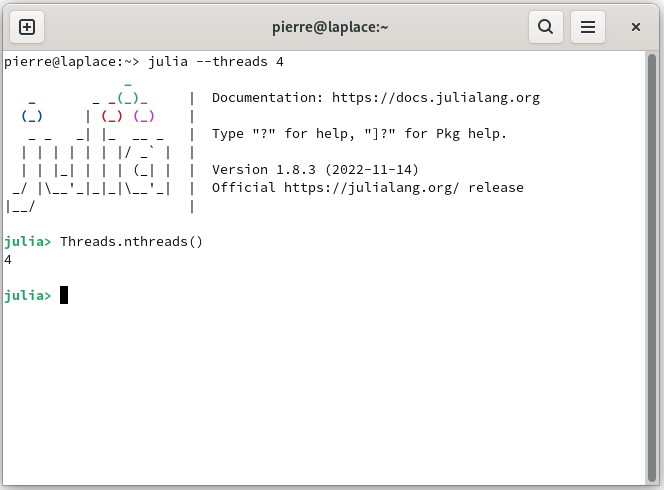
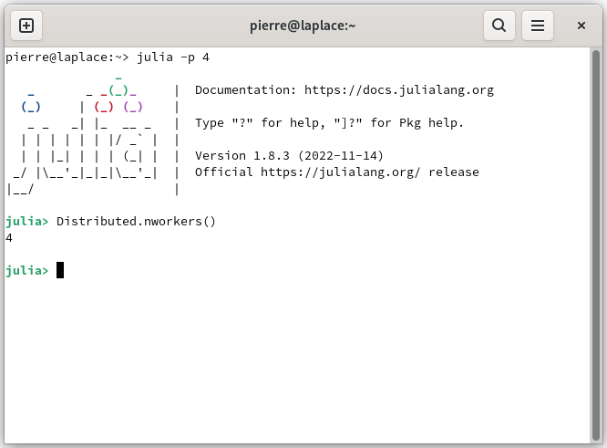

# Manage the electronic circuit

With AutomationLabs you can use several processors, such as the central processing unit (CPU) or the graphics processing unit (GPU) for tuning models. Also, it is possible to use several cpu cores to tune the models in parallel during the hyperparameters optimization.

## Central processing unit

The list of tuned models with several cores for hyperparameters optimization are:

| Architecture        | Multi-threads CPU | Multi-processes CPU |
| ------------------- | ----------------- | ------------------- |
| Linear              | \[ ]              | \[ ]                |
| Fnn                 | \[x]              | \[x]                |
| Rbf                 | \[x]              | \[x]                |
| Icnn                | \[x]              | \[x]                |
| ResNet              | \[x]              | \[x]                |
| PolyNet             | \[x]              | \[x]                |
| DenseNet            | \[x]              | \[x]                |
| NeuralNetODE\_type1 | \[x]              | \[x]                |
| NeulraNetODE\_type2 | \[x]              | \[x]                |
| Rnn                 | \[x]              | \[x]                |
| Lstm                | \[x]              | \[x]                |
| Gru                 | \[x]              | \[x]                |

where, \[ ] not several cores and \[x] several cores.

In order to tune a model with multi-threads, the `computation_processor` parameter is modified, such as:

```bash
~> julia --threads 4
```



```julia
julia> model(:tune; 
          project_name = "QTP_test",
          model_name = "model_qtp_nonlinear",
          io = "io_qtp",
          computation_solver = "radam",
          computation_maximum_time = Dates.Minute(15),
          model_architecture = "fnn", 
          computation_processor = "cpu_threads",
          )
```

In order to tune a model with multi-processes, the `computation_processor` parameter is modified, such as:

```bash
~> julia -p 4
```



```julia
julia> model(:tune; 
          project_name = "QTP_test",
          model_name = "model_qtp_nonlinear",
          io = "io_qtp",
          computation_solver = "RADAM",
          computation_maximum_time = Dates.Minute(15),
          model_architecture = "Fnn", 
          computation_processor = "CPUProcesses",
          )
```

By default the AutomationLabs tool uses single thread computing.

## Graphics processing unit

By default the AutomationLabs tool will use the graphics processing unit calculation if it is available and CUDA.jl is installed and running on the machine. However, the GPU capability depends upon the blackbox model and the algorithm chosen to tune the weights.The list of tuned models with GPU capabilities are:

| Architecture        | GPU  |
| ------------------- | ---- |
| Linear              | \[ ] |
| Fnn                 | \[x] |
| Rbf                 | \[x] |
| Icnn                | \[x] |
| ResNet              | \[x] |
| PolyNet             | \[x] |
| DenseNet            | \[x] |
| NeuralNetODE\_type1 | \[x] |
| NeulraNetODE\_type2 | \[x] |
| Rnn                 | \[x] |
| Lstm                | \[x] |
| Gru                 | \[x] |

where, \[ ] not gpu and \[x] gpu.