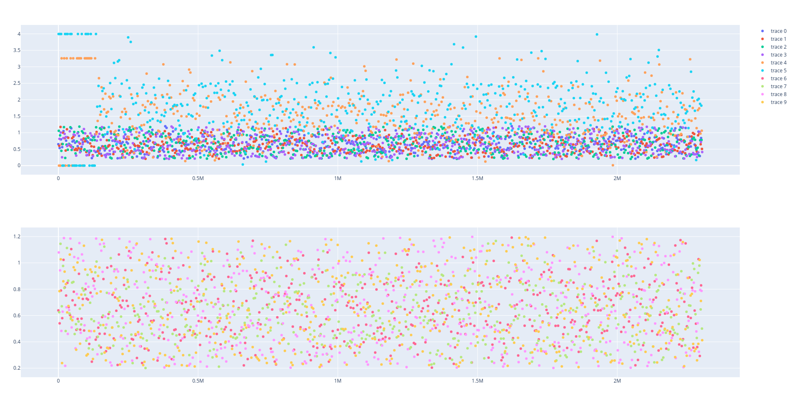

# Manage your first data

Before identifying a model of the dynamic system, it is necessary to store the data of the dynamic system on the database. In this tutorial you will learn:

* [Load data](@ref)
* [Input-output data](@ref)
* [Delete data](@ref)

## Load data

AutomationLabs can load CSV file to store the data on database and carry out processing on the data. Also, the data will allow the identification of a model. For a quick start, we will use in this example the data from the article \[1]. The data can be downloaded on the [quadruple tank process  repository](https://github.com/AutomationLabs-sh/quadruple-tank-process). The dynamical system has four tanks, two pumps and two three-way valves.


Launch the AutomationLabs:

```julia
julia> using AutomationLabs
```

You can create a new project, because the data, the models, the controllers and the plots are located on a project:

```julia
julia> project(:create, name = "QTP_test")
```

You can also, list all the project that are available on the database:

```julia
julia> project(:ls)
```


The inputs of the dynamical system are added to the database:

```julia
julia>  data(
          :add; 
          project_name = "QTP_test", 
          path = "path_of_the_CSV_file",
          name = "data_inputs_m3h",
       )
```

The outputs of the dynamical system are added to the database:

```julia
julia> data(
          :add; 
          project_name = "QTP_test", 
          path = "path_of_the_CSV_file",
          name = "data_outputs",
       )
```

You can list the raw data that are available on the database, such as:

```julia
julia> data(:lsraw, project_name = "QTP_test")
```


Finally, it is possible to plot the raw data that you have added on the database with the `dash` command:&#x20;

```julia
julia> dash(:rawdata, 
                project_name = "QTP_test",
                data_name = "data_inputs_m3h",
                recipe = "temporal",
                dash_name = "inputs_plot",
                )
```


## Input-output data

In order to perform a model identification, the data need to be formatted. As such the io data is introduced:

```julia
julia> data(:io,
              inputs_data_name =  "data_inputs_m3h",
              outputs_data_name = "data_outputs",
              project_name = "QTP_test", 
              data_name = "io1",
    )
```

where `:io` is the input-output information, `inputs_data_name` is the raw data of the dynamical system inputs, `outputs_data_name` is the raw data of the dynamical system outputs, `project_name` is the project where the raw are located and where the io data will be located, `data_name` is the name of the io data. There are additional parameters that allow the data to be processed. For example, it is possible to set a low or high limit on the data, more information can be found in the guides section:

[Interact with data](@ref)

You can list all the io data available on a project:

```julia
julia> data(:lsio, project_name = "QTP_test")
```

It is possible to plot the io data that you have processed with the `dash` command:

```julia
julia> dash(:iodata, 
                project_name = "QTP_test",
                data_name = "io1",
                recipe = "temporal",
                dash_name = "io_plot",
        )
```



## Delete data

It is possible to delete the data, such as:

```julia
julia> data(:rmio, project_name = "QTP_test", data_name = "io1")
```

```julia
julia> model(:rmraw, project_name = "QTP_test", data_name = "data_outputs")
```

```julia
julia> model(:rmraw, project_name = "QTP_test", data_name = "data_intputs_m3h")
```

## Reference

\[1] Blaud, P. C., Chevrel, P., Claveau, F., Haurant, P., & Mouraud, A. (2022). ResNet and PolyNet based identification and (MPC) control of dynamical systems: a promising way. _IEEE Access_.
