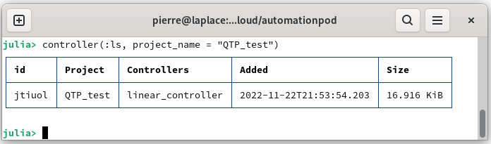
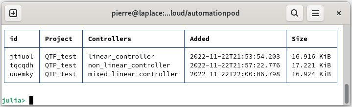
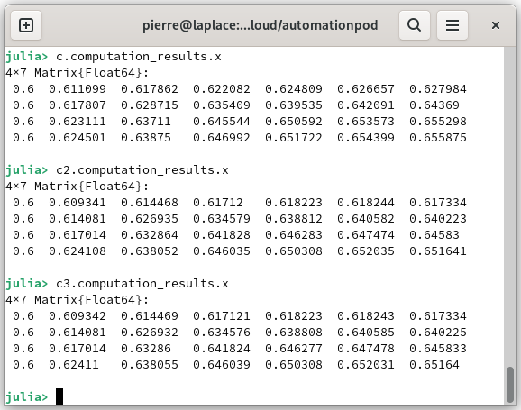
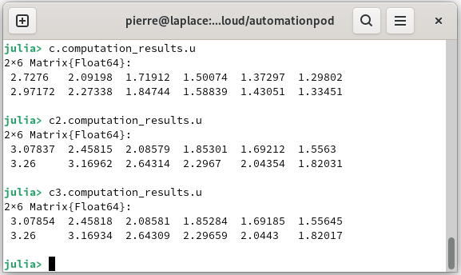

# Tune your first controller

From a model, it is possible to create a controller based on model predictive control, and it will be saved on the database. It can be set to be linear or non-linear and the solver can be selected by the user or automatically. In addition, it will be possible to calculate the controller from the initialization of the states to compute the optimal state and input control. In this tutorial you will learn:

* [Prepare a model for tuning a controller](@ref)
* [Tune a linear controller](@ref)
* [Tune a non linear controller](@ref)
* [Tune a mixed integer controller](@ref)
* [Calculate a controller](@ref)
* [Delete a controller](@ref)

## Prepare a model for tuning a controller

The following steps are identical to the section [Tune your first model](@ref) they are developed to tune a non-linear model, needed to tune the controller. You can go to the next section if you already have the model.

Launch AutomationLabs on Julia:

```julia
julia> using AutomationLabs
```

Create a project, if not already created:

```julia
julia> project(:create, name = "QTP_test")
```

Load the data from a quadruple tank process \[1] on the [repository data.](https://github.com/AutomationLabs-sh/quadruple-tank-process) The data of the dynamical system inputs can be added (you can have a look on [Manage your first data](@ref)):

```julia
julia>  data(
          :add; 
          project_name = "QTP_test", 
          path = "paht_of_the_CSV_file",
          name = "data_inputs_m3h",
       )
```

The outputs of the dynamical system can be added to the database:

```julia
julia> data(
          :add; 
          project_name = "QTP_test", 
          path = "paht_of_the_CSV_file",
          name = "data_outputs",
       )
```

Create the io data with bound on the raw data:

```julia
julia>  lower_in = [0.2 0.2 0.2 0.2 -Inf -Inf]
        upper_in = [1.2 1.2 1.2 1.2 Inf Inf]
        lower_out = [0.2 0.2 0.2 0.2]
        upper_out = [1.2 1.2 1.2 1.2]

        data(:io;
                inputs_data_name =  "data_inputs_m3h",
                outputs_data_name = "data_outputs",
                project_name = "QTP_test", 
                data_name = "io_qtp",
                data_lower_input = lower_in,
                data_upper_input = upper_in,
                data_lower_output = lower_out,
                data_upper_output = upper_out,
            )
```

Tune a non-linear model for dynamical system identification, such as:

```julia
julia> using Dates 
```

```julia
julia> model(:tune; 
          project_name = "QTP_test",
          model_name = "model_qtp_nonlinear",
          io = "io_qtp",
          computation_solver = "radam",
          computation_maximum_time = Dates.Minute(15),
          model_architecture = "fnn", 
          )
```

You now have a model of the quadruple tank process. It is now possible to go to the creation of the controller to control the dynamic system.

## Tune a linear controller

The first desired controller is a linear model predictive control with a quadratic cost function. To learn more about the control you can go to the guides section:


[model-predictive-control.md](../guides/administrate-controllers/model-predictive-control.md)


The linearization of the non linear model is performed at the state and input references. However, it is required to defined the constraints and the references, such as:

```julia
julia>  hmin = 0.2;
        h1max = 1.36;
        h2max = 1.36;
        h3max = 1.30;
        h4max = 1.30;
        qmin = 0;
        qamax = 4;
        qbmax = 3.26;

        #Constraint definition:
        mpc_lower_state_constraints = [hmin, hmin, hmin, hmin]
        mpc_higher_state_constraints = [h1max, h2max, h3max, h4max]
        mpc_lower_input_constraints = [qmin, qmin]
        mpc_higher_input_constraints = [qamax, qbmax]

        mpc_state_reference = [0.65, 0.65, 0.65, 0.65]
        mpc_input_reference = [1.2, 1.2]
```

Now we can set up the controller:

```julia
julia>  c = controller(:tune; 
                project_name = "QTP_test",
                model_name = "model_qtp_nonlinear",
                controller_name = "linear_controller",
                mpc_controller_type = "model_predictive_control",
                mpc_programming_type = "linear",
                mpc_lower_state_constraints = mpc_lower_statie_constraints,
                mpc_higher_state_constraints = mpc_higher_state_constraints,
                mpc_lower_input_constraints = mpc_lower_input_constraints,
                mpc_higher_input_constraints = mpc_higher_input_constraints,
                mpc_horizon = 6,
                mpc_sample_time = 5,
                mpc_state_reference = mpc_state_reference,
                mpc_input_reference = mpc_input_reference,       
            ) 
```

where `project_name` is the related project, `model_name` is the name used for tuning the controller, `mpc_controller_type` is the related control, `mpc programming_type` is the implementation method, `mpc_lower_state_constraints` is the state constraints, `mpc_higher_sate_constraints` is the state constraints, `mpc_lower_input_constraints` is the input control constraints, `mpc_higher_input_constraints` is the input control constraints, `mpc_horizon` is the horizon length, `mpc_sample_time` is the time between two samples, `mpc_state_reference` is the state reference and `mpc_input_reference` is the input reference related to the model predictive control.

You can list the controller from the project:

```julia
julia> controller(:ls, project_name = "QTP_test")
```



## Tune a non-linear controller

Previously we tuned a linear controller, we can also tune a non linear controller easily by changing the parameter `mpc_programming_type`, such as:

```julia
julia>  c2 = controller(:tune; 
                project_name = "QTP_test",
                model_name = "model_qtp_nonlinear",
                controller_name = "non_linear_controller",
                mpc_controller_type = "model_predictive_control",
                mpc_programming_type = "non_linear",
                mpc_lower_state_constraints = mpc_lower_state_constraints,
                mpc_higher_state_constraints = mpc_higher_state_constraints,
                mpc_lower_input_constraints = mpc_lower_input_constraints,
                mpc_higher_input_constraints = mpc_higher_input_constraints,
                mpc_horizon = 6,
                mpc_sample_time = 5,
                mpc_state_reference = mpc_state_reference,
                mpc_input_reference = mpc_input_reference,    
                mpc_solver = "ipopt"   
         )    
```

where `project_name` is the related project, `model_name` is the name used for tuning the controller, `mpc_controller_type` is the related control, `mpc programming_type` is the implementation method, `mpc_lower_state_constraints` is the state constraints, `mpc_higher_sate_constraints` is the state constraints, `mpc_lower_input_constraints` is the input control constraints, `mpc_higher_input_constraints` is the input control constraints, `mpc_horizon` is the horizon length, `mpc_sample_time` is the time between two samples, `mpc_state_reference` is the state reference, `mpc_input_reference` is the input reference related to the model predictive control and `mpc_solver` allows you to choose the resolution solver.

You can list the controller from the project:

```julia
julia> controller(:ls, project_name = "QTP_test")
```


## Tune a mixed integer controller

Previously we tuned a non-linear model based on feedforward neural networks. The activation functions were `relu.` In this case it is possible to take into account the particularity of this activation function to reformulate the optimization problem with integer numbers. We can tune a controller with mixed integer programming, such as:

```julia
julia> c3 = controller(:tune; 
                project_name = "QTP_test",
                model_name = "model_qtp_nonlinear",
                controller_name = "mixed_linear_controller",
                mpc_controller_type = "model_predictive_control",
                mpc_programming_type = "mixed_linear",
                mpc_lower_state_constraints = mpc_lower_state_constraints,
                mpc_higher_state_constraints = mpc_higher_state_constraints,
                mpc_lower_input_constraints = mpc_lower_input_constraints,
                mpc_higher_input_constraints = mpc_higher_input_constraints,
                mpc_horizon = 6,
                mpc_sample_time = 5,
                mpc_state_reference = mpc_state_reference,
                mpc_input_reference = mpc_input_reference,    
         )
```

where `project_name` is the related project, `model_name` is the name used for tuning the controller, `mpc_controller_type` is the related control, `mpc programming_type` is the implementation method, `mpc_lower_state_constraints` is the state constraints, `mpc_higher_sate_constraints` is the state constraints, `mpc_lower_input_constraints` is the input control constraints, `mpc_higher_input_constraints` is the input control constraints, `mpc_horizon` is the horizon length, `mpc_sample_time` is the time between two samples, `mpc_state_reference` is the state reference and`mpc_input_reference` is the input reference related to the model predictive control.

You can list the controller from the project:

```julia
julia> controller(:ls, project_name = "QTP_test")
```


## Calculate a controller

We can calculate the controller with a state intialization (or state measure), such as:

```julia
julia> initialization = [0.6, 0.6, 0.6, 0.6]
```

```julia
julia> c = controller(:calculate; initialization =  initialization, predictive_controller = c)
       c2 = controller(:calculate; initialization =  initialization, predictive_controller = c2)
       c3 = controller(:calculate; initialization =  initialization, predictive_controller = c3)
```

where `initialization` is the state initialization or the state measure and `predictive_controller` is the controller to calculate.

We can retrieve the computed state:

```julia
julia>  c.computation_results.x
        c2.computation_results.x
        c3.computation_results.x
```



We can retrieve the computed input control:

```julia
julia>  c.computation_results.u
```



## Delete a controller

It is possible to delete the tuned controllers from the database, such as:

```julia
julia> controller(:rm, project_name = "QTP_test", controller_name = "non_linear_controller")
```

## Reference

\[1] Blaud, P. C., Chevrel, P., Claveau, F., Haurant, P., & Mouraud, A. (2022). ResNet and PolyNet based identification and (MPC) control of dynamical systems: a promising way. _IEEE Access_.

