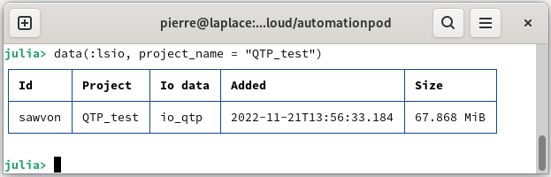
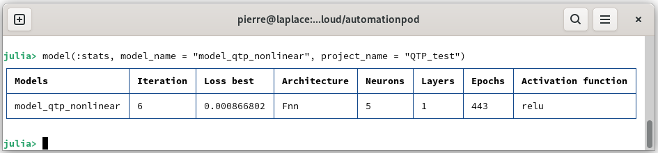
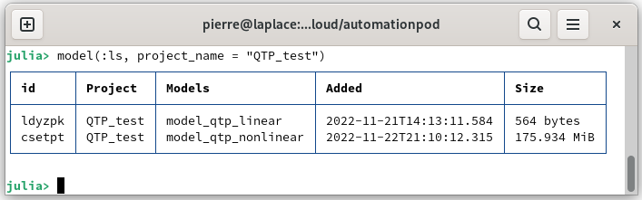

# Tune your first model

From the data added in the database, you can identify the dynamic system and thus obtain a model. This model can be linear or non-linear according to your selection. Furthermore, there are different methods to tune the model parameters while optimizing the hyperparameters. In this tutorial you will learn:

* [Prepare the data](@ref)
* [Tune a linear model](@ref)
* [Tune a non linear model](@ref)
* [Delete the models](@ref)

## Prepare the data

Launch AutomationLabs on Julia:

```julia
julia> using AutomationLabs
```

Create a project, if not already created:

```julia
julia> project(:create, name = "QTP_test")
```

Load the data from a quadruple tank process \[1] on the [repository data.](https://github.com/AutomationLabs-sh/quadruple-tank-process) The data of the dynamical system inputs can be added (you can have a look on [Manage your first data](manage-your-first-data.md)):

```julia
julia>  data(
          :add; 
          project_name = "QTP_test", 
          path = "paht_of_the_CSV_file",
          name = "data_inputs_m3h",
       )
```

The outputs of the dynamical system can be added to the database:

```julia
julia> data(
          :add; 
          project_name = "QTP_test", 
          path = "paht_of_the_CSV_file",
          name = "data_outputs",
       )
```

Create the io data with bound on the raw data:

```julia
julia>  lower_in = [0.2 0.2 0.2 0.2 -Inf -Inf]
        upper_in = [1.2 1.2 1.2 1.2 Inf Inf]
        lower_out = [0.2 0.2 0.2 0.2]
        upper_out = [1.2 1.2 1.2 1.2]

        data(:io;
                inputs_data_name =  "data_inputs_m3h",
                outputs_data_name = "data_outputs",
                project_name = "QTP_test", 
                data_name = "io_qtp",
                data_lower_input = lower_in,
                data_upper_input = upper_in,
                data_lower_output = lower_out,
                data_upper_output = upper_out,
            )
```

You can list the data from the project:



## Tune a linear model

We can now tune the first model. We will perform the identification of the dynamic system by a linear model, such as:

```julia
julia> model(:tune; 
        project_name = "QTP_test",
        model_name = "model_qtp_linear",
        io = "io_qtp",
        model_architecture = "linear", 
        computation_solver = "lls",
    )
```

where, `project_name` is the project where the model will be saved, `model_name` is the name of the model after tuning, `io` is the data used for dynamical system identification and `model_architecture` allows you to select the type of model. So, for a linear model, it is `model_architecture = "Linear"`.

You can list the model available on the database:

```julia
julia> model(:ls, project_name = "QTP_test")
```


## Tune a non linear model

It possible to tune a non-linear model for dynamical system identification, such as:

```julia
julia> using Dates 
```

```julia
julia> model(:tune; 
          project_name = "QTP_test",
          model_name = "model_qtp_nonlinear",
          io = "io_qtp",
          computation_solver = "radam",
          computation_maximum_time = Dates.Minute(15),
          model_architecture = "fnn", 
          )
```

where, `computation_maximum_time` is the time allocated for tuning with the hyperparameters optimization and it requires `Dates` package.  `model_architecture` allows you to select the type of model. So, for a non-linear model with a feedforward neural networks, it is `model_architecture = "Fnn"`. For example, it is possible to set other parameters, more information can be found in the guides section:

[Interact with models](@ref)

It is possible to present information about the best tuning model:

```julia
julia> model(:stats, model_name = "model_qtp_nonlinear", project_name = "QTP_test")
```



You can list the models available on the database:

```julia
julia> model(:ls, project_name = "QTP_test")
```



## Delete the models

It is possible to delete the tuned models, such as:

```julia
julia> model(:rm, project_name = "QTP_test", model_name = "model_qtp_nonlinear")
```

```julia
julia> model(:rm, project_name = "QTP_test", model_name = "model_qtp_linear")
```

## Reference

\[1] Blaud, P. C., Chevrel, P., Claveau, F., Haurant, P., & Mouraud, A. (2022). ResNet and PolyNet based identification and (MPC) control of dynamical systems: a promising way. _IEEE Access_.